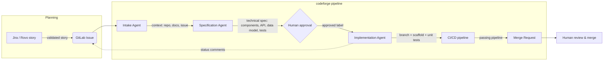

# codeforge

**An automated spec-to-code AI agent chain**: a validated backlog item goes in, a reviewed Merge Request comes out.

This project is a portfolio implementation of the "Intake → Specification → Implementation" agent
pipeline used by GitLab Duo-style automation initiatives that connect planning tools (Jira/Rovo) to
GitLab's CI/CD and code review workflow.

> ⚠️ **Status:** portfolio/demo project. Defaults to `DRY_RUN=true` so it is always safe to run
> without touching a real GitLab project.

## Why this exists

Teams increasingly want an AI chain that turns an approved user story into a working, human-reviewed
Merge Request — without a human writing the boilerplate. `codeforge` demonstrates the full loop end
to end on GitLab:



## Agents

| Agent | Responsibility |
|---|---|
| **Intake Agent** | Pulls a GitLab issue, extracts context from the repo (README, related files) and issue discussion. |
| **Specification Agent** | Uses an LLM to derive a technical spec (affected components, API interfaces, data models, test cases) and posts it as an issue comment awaiting approval. |
| **Implementation Agent** | Creates a branch, generates code scaffolding + initial unit tests via tool-calling, and opens a Merge Request with a change summary. |
| **Feedback Loop** | Writes real-time status updates back to the GitLab issue at each stage. |

All write actions (branch creation, commits, MRs, comments) go through a single GitLab client that
respects `DRY_RUN`, uses a scoped access token, and logs every action to an append-only audit log.

## Architecture

- **Language:** Python 3.11+
- **LLM:** Anthropic Claude (tool calling / function calling), provider interface is swappable.
- **GitLab integration:** `python-gitlab`, scoped token, dry-run mode by default.
- **MCP server:** exposes the same pipeline actions (`fetch_issue`, `draft_spec`, `open_merge_request`, ...)
  as MCP tools, so any MCP-compatible client (Claude Desktop, custom agents) can drive the pipeline.
- **Guardrails:** scoped tokens only, dry-run default, protected-branch awareness, mandatory human
  approval gate between spec and implementation, full audit logging.

## Project structure

```
src/codeforge/
  config.py            # env-based settings (pydantic-settings), DRY_RUN default
  audit.py              # append-only JSON-lines audit log, redacts secrets
  llm/                  # provider-agnostic LLMClient interface + Claude implementation
  gitlab_client.py       # GitLab reads/writes, all writes dry-run-aware and audited
  agents/
    intake.py            # pulls issue + repo context
    specification.py      # drafts TechnicalSpec via tool-calling, approval gate
    implementation.py     # generates scaffold+tests via tool-calling, opens MR
  orchestrator.py        # wires the three agents + Jira feedback stub
  jira_feedback.py        # JiraFeedbackClient interface + logging-only stub
  mcp_server.py           # exposes the pipeline as MCP tools
  cli.py                 # `codeforge run-issue` / `codeforge mcp-server`
tests/                   # pytest suite, GitLab + LLM fully faked (no network calls)
```

## Setup

```bash
python3 -m venv .venv
source .venv/bin/activate
pip install -e ".[dev]"
cp .env.example .env
# edit .env with your ANTHROPIC_API_KEY and (optionally) a real GitLab project + scoped token
```

## Usage

```bash
codeforge run-issue 42          # runs the full pipeline against GitLab issue #42
codeforge mcp-server            # starts the MCP server for external agent clients
```

`run-issue` drafts and posts a technical spec as an issue comment, then stops and asks for human
approval (add the `codeforge::spec-approved` label to the issue) before generating any code. Re-run
the same command afterwards to let the Implementation Agent scaffold code, tests, and open the MR.

### Using it as an MCP server

Point any MCP-compatible client at the server, e.g. in Claude Desktop's config:

```json
{
  "mcpServers": {
    "codeforge": {
      "command": "codeforge",
      "args": ["mcp-server"]
    }
  }
}
```

Exposed tools: `fetch_issue`, `draft_spec`, `check_spec_approval`, `implement`, `run_pipeline`.

## Testing

```bash
pytest
```

GitLab and the LLM are fully faked in `tests/conftest.py` — the suite runs offline, with no real API
calls, and covers dry-run vs. live-write behavior, the approval gate, and per-file create/update
detection.

## Security notes

- Tokens are read from environment variables only, never hard-coded or logged.
- `DRY_RUN=true` by default — no branch/commit/MR/comment is created against a real project until
  explicitly disabled.
- GitLab tokens should be scoped (`api`, `write_repository` only) project/group access tokens, not
  personal admin tokens.
- All agent actions (spec generation, branch creation, commits, MR creation, comments) are written to
  an append-only audit log for traceability.

## Skills this project demonstrates

| Area | Where |
|---|---|
| LLM integration (Anthropic Claude) | [llm/claude.py](src/codeforge/llm/claude.py) |
| Prompt engineering for code generation | System prompts in [specification.py](src/codeforge/agents/specification.py), [implementation.py](src/codeforge/agents/implementation.py) |
| Tool calling / function calling | Structured `submit_technical_spec` / `submit_code_scaffold` tools, schema-driven via Pydantic |
| MCP server implementation | [mcp_server.py](src/codeforge/mcp_server.py) |
| GitLab API integration (branches, commits, MRs, issues) | [gitlab_client.py](src/codeforge/gitlab_client.py) |
| Governance & security guardrails | Scoped tokens, dry-run default, human approval gate, audit logging |

## Project status / roadmap

- [x] Project scaffolding
- [x] Config + Claude client + audit log
- [x] GitLab client wrapper (dry-run mode)
- [x] Intake Agent
- [x] Specification Agent
- [x] Implementation Agent
- [x] Orchestrator CLI + feedback loop
- [x] MCP server
- [x] Tests
- [x] Docs polish
