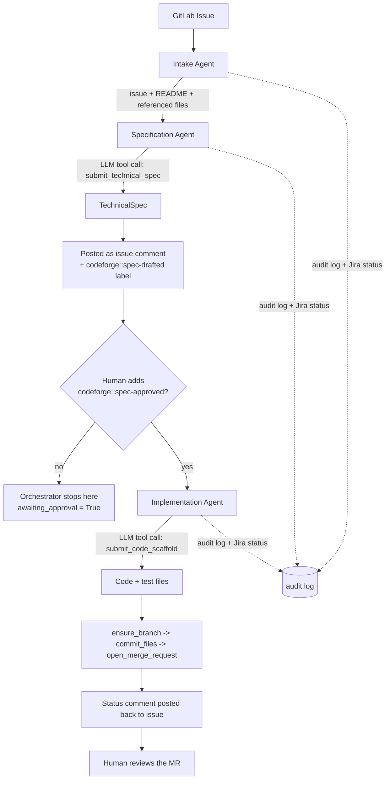

# codeforge — Technical Overview

## What it is

`codeforge` is an automated **spec-to-code AI agent chain** for GitLab: a validated issue goes in,
a human-reviewed Merge Request comes out. It's a portfolio implementation of the "Intake →
Specification → Implementation" pattern used by GitLab Duo-style automation (Jira/Rovo →
technical spec → code scaffold + tests → MR), built from primitives rather than the GitLab Duo
product itself.

## Tech stack

| Layer | Choice |
|---|---|
| Language | Python 3.11+ |
| LLM | Anthropic Claude (default) or Google Gemini (free tier), behind one `LLMClient` interface |
| GitLab integration | `python-gitlab`, scoped access token, dry-run mode by default |
| Tool/function calling | Pydantic models → JSON schema → LLM tool definitions (`submit_technical_spec`, `submit_code_scaffold`) |
| MCP server | `mcp` SDK (2.x), exposes the pipeline as tools for any MCP client |
| CLI | `typer` |
| Tests | `pytest`, GitLab + LLM fully faked — no network calls, 45 tests |
| CI | GitHub Actions (this repo); example `.gitlab-ci.yml` for target projects |

## Components

- **`config.py`** — all settings from env vars (`.env`), safe defaults (`DRY_RUN=true`).
- **`audit.py`** — append-only JSON-lines audit log, redacts secret-looking values.
- **`llm/`** — `LLMClient` interface, `ClaudeClient` / `GeminiClient` implementations, `BudgetedLLMClient`
  (caps calls per run as a cost/abuse guardrail).
- **`gitlab_client.py`** — all GitLab reads/writes. Writes are dry-run-aware, audit-logged, and reject
  unsafe file paths (absolute paths, `../` traversal) before anything is committed.
- **`agents/`**
  - `intake.py` — pulls a GitLab issue + repo README + any files it references.
  - `specification.py` — drafts a structured `TechnicalSpec` via LLM tool-calling, posts it as an
    issue comment with a hidden marker (so it can be recovered later verbatim), gates progress
    behind a human-applied `codeforge::spec-approved` label.
  - `implementation.py` — generates a code scaffold + tests via tool-calling, branches, commits,
    opens the MR, posts a status comment back to the issue.
- **`orchestrator.py`** — wires the three agents together, posts status updates through a
  `JiraFeedbackClient` stub (logging-only; a real Jira client would implement the same interface).
- **`mcp_server.py`** — exposes `fetch_issue`, `draft_spec`, `check_spec_approval`, `implement`,
  `run_pipeline` as MCP tools.
- **`cli.py`** — `codeforge run-issue <iid>`, `codeforge mcp-server`.

## Pipeline flow

Every write in the flow above (`add_issue_comment`, `set_issue_labels`, `ensure_branch`,
`commit_files`, `open_merge_request`) goes through `GitLabClient`, respects `DRY_RUN`, and is
recorded in the audit log — regardless of which agent triggered it.

## Guardrails (what stops this from being a naive "LLM writes to prod" pipeline)

1. **Dry-run by default** — no write reaches GitLab until explicitly disabled.
2. **Human approval gate** — the Implementation Agent only runs after a person adds a label;
   nothing is automatic end-to-end.
3. **Scoped tokens only** — `api` scope, short expiry, never a personal/admin token.
4. **Path safety** — generated file paths are validated against traversal/absolute paths before
   any commit.
5. **LLM call budget** — caps calls per run/session against runaway loops or cost abuse.
6. **Retries + timeouts** — both the LLM and GitLab clients handle transient errors (429/5xx)
   with backoff instead of failing hard.
7. **Full audit trail** — every agent action is logged, secrets redacted.
8. **Human code review is still required** — demonstrated concretely: a real test run produced a
   FastAPI endpoint the target repo had no dependency on, which would fail CI until a human adds
   the missing `requirements.txt` entry. The pipeline generates a *draft*, not a merge-ready patch.

## How it was built (milestone sequence)

1. Project scaffolding (pyproject, license, env template, README)
2. Config, audit log, pluggable LLM client (Claude)
3. GitLab client wrapper (dry-run mode)
4. Intake Agent
5. Specification Agent (tool-calling + approval gate)
6. Implementation Agent (scaffold + tests + MR)
7. Orchestrator, CLI, Jira feedback stub
8. MCP server
9. Test suite (45 tests, everything faked)
10. Hardening pass: retries/timeouts, CI, LLM budget, path-traversal validation, spec persistence
    via GitLab comment marker (not an in-memory cache)
11. Added Gemini as a second, free-tier LLM provider
12. Verified end-to-end against a real GitLab project — real spec drafted, real approval gate,
    real MR opened (`!1` on the demo project)
